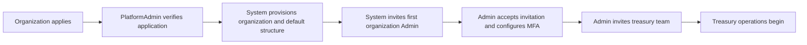
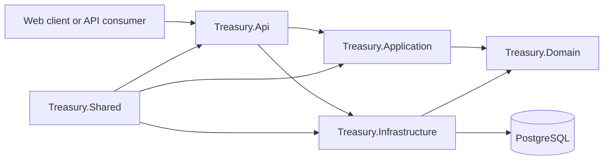

# Corporate Treasury Platform — Engineering Case Study

## Project summary

Corporate Treasury Platform is a multi-organization treasury-management
backend designed to bring cash visibility, controlled transaction workflows,
reconciliation, forecasting, investments, credit facilities, audit evidence,
and operational reporting into one system.

The project models the controls expected in serious financial software:
organization isolation, role-based access, maker-checker approvals,
idempotent commands, optimistic concurrency, immutable financial records,
rotating authentication sessions, and traceable operational decisions.

**[Open the live demonstration](https://corporatetreasuryplatform-frontend.mobolajiadebola.workers.dev/)**

The hosted workspace contains fictional demonstration data only.

> **Current scope:** this repository contains the ASP.NET Core backend API.
> Payment-rail connectivity, live bank feeds, and live market-data feeds are
> intentionally outside the current boundary.

## The problem

Corporate treasury teams often coordinate balances, payments, approvals,
bank statements, investments, debt, and forecasts across spreadsheets and
disconnected tools. That creates several risks:

- fragmented cash visibility;
- unclear ownership of approvals;
- accidental duplicate posting;
- weak separation of duties;
- difficult reconciliation and audit preparation;
- inconsistent handling of organizations, entities, currencies, and users;
- risky migration of balances and historical records from legacy systems.

The goal was to design a backend that treats these concerns as connected
workflows instead of isolated CRUD screens.

## Product workflow

The onboarding flow separates platform ownership from customer administration:

Approval creates the organization, default legal entity, business unit,
approval policies, and first-Admin invitation. The `PlatformAdmin` remains
outside customer treasury operations.

## Engineering scope

The implemented backend includes:

- organization onboarding and first-Admin invitation;
- multi-organization memberships and organization switching;
- accounts, ledgers, receipts, payments, transfers, and reversals;
- configurable approval policies and approval history;
- bank-statement import, matching, exceptions, and reconciliation;
- cash-flow forecasts, variance, FX rates, and exposure reporting;
- investment counterparties, limits, placements, accruals, maturities,
  early redemptions, and rollovers;
- credit facilities, drawdowns, repayments, accruals, and lifecycle controls;
- alerts, audit logs, CSV exports, and dashboards;
- historical-transaction import and controlled opening-balance cutover;
- health checks, Docker deployment, configuration validation, and CI.

At the time of this case study, the codebase contains 32 API controllers,
approximately 200 documented API and health route patterns, 52 EF Core schema
migrations, and 192 automated test cases.

## Architecture

- **API:** controllers, authorization, middleware, rate limiting, workers,
  health checks, and dependency registration.
- **Application:** contracts, DTOs, validators, and service interfaces.
- **Domain:** financial and organizational entities.
- **Infrastructure:** EF Core, repositories, authentication, email delivery,
  and service implementations.
- **Tests:** unit and PostgreSQL-backed integration coverage.

The API uses .NET 10, ASP.NET Core, Entity Framework Core, PostgreSQL,
FluentValidation, xUnit, Moq, and Testcontainers.

## Key engineering decisions

### Tenant isolation in persistence

Organization-owned entities carry an `OrganizationId`. EF Core global query
filters restrict reads to the active organization, while write-time checks
prevent records from crossing that boundary. Tenant isolation is therefore a
backend invariant rather than a frontend convention.

### Immutable financial history

Completed financial transactions and approval decisions are immutable.
Corrections create linked reversal transactions and compensating ledger effects
instead of rewriting history.

### Maker-checker approval

Payments, transfers, reversals, investment operations, and credit activation
can require independent approval. Policies define thresholds, currency,
approval count, and expiry. A maker cannot approve their own request, and
pending cash payments reserve funds.

### Explicit retry and concurrency behavior

Supported financial and onboarding commands use idempotency keys so clients
can safely retry uncertain requests. Mutable aggregates use concurrency tokens
so stale updates fail instead of silently overwriting newer state.

### Controlled legacy-data migration

The platform separates reporting-only historical transactions from cutover
opening balances. Historical records never change live balances. Opening
balances create controlled transactions and ledger entries only after
independent Admin and CFO approval.

### Revocable authentication sessions

The platform uses short-lived JWT access tokens and rotating refresh-token
sessions. Refresh tokens are stored server-side as hashes and delivered through
Secure, HttpOnly cookies. TOTP MFA, recovery codes, login-abuse protection,
password recovery, session revocation, and security-event reporting are also
implemented.

## Production-readiness work

The repository includes:

- liveness and PostgreSQL-backed readiness checks;
- correlation IDs and centralized safe error responses;
- production security headers, HSTS, and credentialed CORS;
- forwarded-header and trusted-proxy controls;
- database-backed ASP.NET data-protection keys;
- startup validation for unsafe or missing production settings;
- HTTPS email delivery through Resend;
- a multi-stage, non-root Docker image;
- a Render deployment blueprint; and
- GitHub Actions for warning-free builds, tests, and NuGet security audits.

## Testing strategy

The test suite combines focused service tests with PostgreSQL-backed
integration tests. High-risk scenarios cover tenant isolation, organization
switching, invitation acceptance, session security, maker-checker rules,
idempotency, concurrency, atomic balance updates, imports, reconciliation,
investment and credit lifecycles, and deployment readiness.

PostgreSQL Testcontainers are used where provider-specific behavior matters,
rather than relying only on an in-memory database substitute.

## Deployment

The demonstration topology uses Render for the containerized API, Neon for
PostgreSQL and persisted data-protection keys, Cloudflare Pages for the separate
frontend, and Resend for invitation and password-recovery emails.

The free-tier deployment is intended for portfolio demonstration, not real
treasury operations. The API can sleep after inactivity, and external banking
integrations are not enabled.

## Results

The backend provides a coherent domain model and API for an end-to-end treasury
workflow rather than a collection of unrelated endpoints. Outcomes include:

- customer onboarding without granting platform-level privileges;
- tenant isolation for users with one or multiple memberships;
- auditable operations with immutable history;
- safe retries and stale-write handling;
- independently approved migration and cutover;
- operational monitoring, exports, and reconciliation; and
- repeatable build, test, container, and deployment paths.

## Trade-offs and next steps

The current design prioritizes correctness and traceability. Future production
work includes bank/payment adapters, automated statement and FX feeds,
enterprise SSO, centralized observability, backup and disaster recovery,
external scheduling, and an API-enforced read-only demo mode with data reset.

## Explore the project

- [Source repository](https://github.com/Kingmoballs/CorporateTreasuryPlatform)
- [Architecture and security](docs/architecture-and-security.md)
- [Application flow](docs/frontend-application-flow.md)
- [Roles and access](docs/roles-and-access.md)
- [API reference](docs/api-reference.md)
- [Development and deployment](docs/development-and-deployment.md)
- [Recruiter demo setup](docs/recruiter-demo.md)
- [UAT scenarios](docs/uat-scenarios.md)

- [Live frontend](https://corporatetreasuryplatform-frontend.mobolajiadebola.workers.dev/)
