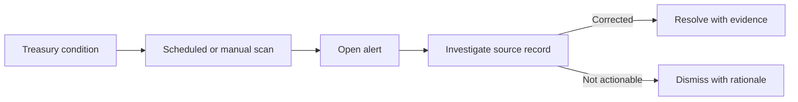

# Alerts, audit, and reporting

## Treasury alerts

Alerts consolidate operational conditions that require
attention. Alert types cover low liquidity, forecast gaps,
pending approvals, reconciliation exceptions, FX exposure,
audit exceptions, investment maturity and concentration,
investment-limit warnings or breaches, credit overdue items, and
system conditions.

- `POST /api/treasury-alerts`
- `GET /api/treasury-alerts`
- `GET /api/treasury-alerts/summary`
- `GET /api/treasury-alerts/export/csv`
- `POST /api/treasury-alerts/{id}/resolve`
- `POST /api/treasury-alerts/{id}/dismiss`
- `POST /api/treasury-alerts/run-scan`

The API background worker can run configured alert scans.
`Admin`, `FinanceManager`, and `CFO` can also start a scan.

Resolving an alert records that the underlying condition was
handled. Dismissing records that the alert does not require
action. Neither action should be used to hide an unresolved
financial discrepancy.

## Audit logs

- `GET /api/audit-logs`
- `GET /api/audit-logs/export/csv`

Audit access is available to `Admin`, `FinanceManager`, and
`CFO`. Use filters to locate the organization, user, operation,
resource, and time window relevant to an investigation.

For support or incident investigation, correlate:

- audit-log event;
- authentication security event, when relevant;
- transaction or approval reference;
- request `traceId`; and
- `X-Correlation-ID` from the HTTP response or logs.

Audit records should be exported and retained according to the
organization's regulatory and internal-control policy.

## Authentication security events

Organization `Admin`:

`GET /api/v1/admin/authentication-security-events`

These events cover security-relevant authentication activity
such as failed logins, lockouts, refresh-token anomalies, session
revocations, MFA events, and password recovery behavior. They
must not expose stored password hashes, refresh-token values,
MFA secrets, or recovery codes.

## Treasury reporting

- `GET /api/treasury/balances`
- `GET /api/treasury/dashboard`
- `GET /api/treasury/liquidity`
- `GET /api/treasury/liquidity/export/csv`

The dashboard is an operational summary, not a replacement for
source transaction and ledger evidence. Drill from totals into
accounts, transactions, pending approvals, reconciliation
exceptions, and alerts.

Related reporting endpoints:

- transaction activity:
  `GET /api/transactions/activity-summary`;
- transaction export:
  `GET /api/transactions/export/csv`;
- forecast variance:
  `GET /api/cash-flow-forecasts/variance`;
- currency exposure:
  `GET /api/fx-rates/currency-exposure`;
- investment portfolio:
  `GET /api/investment-placements/portfolio-report`;
- investment maturity schedule:
  `GET /api/investment-placements/maturity-schedule`;
- investment-limit utilization:
  `GET /api/investment-limits/utilization`;
- historical-import dashboard:
  `GET /api/v1/historical-imports/dashboard`.

## Daily control cycle

1. Review critical and overdue alerts.
2. Review balances and liquidity by currency.
3. Review pending payment, transfer, reversal, investment, and
   credit approvals.
4. Review bank and book reconciliation exceptions.
5. Review forecast variance and upcoming cash requirements.
6. Review FX exposure and rate freshness.
7. Review approaching investment and facility maturities.
8. Export evidence required for the daily control file.

## Month-end control cycle

- Complete statement imports and reconciliation.
- Resolve or formally document every exception.
- Generate investment and facility accruals.
- Process controlled maturity jobs.
- Review opening-balance and historical-import evidence for a
  recent cutover.
- Export transaction, liquidity, variance, exposure, investment,
  limit, alert, and audit reports.
- Retain approval histories and correlation references for
  material transactions.

CSV exports reflect the caller's active organization and applied
filters. Treat exported files as sensitive financial data.

