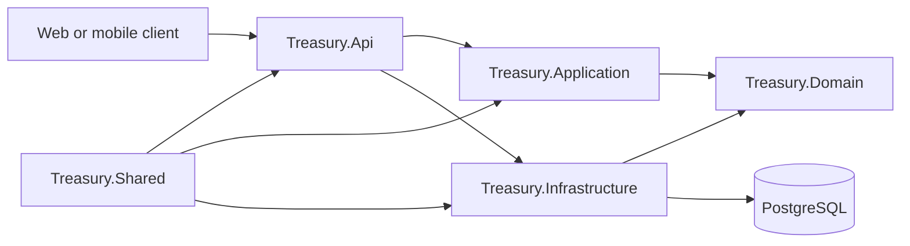
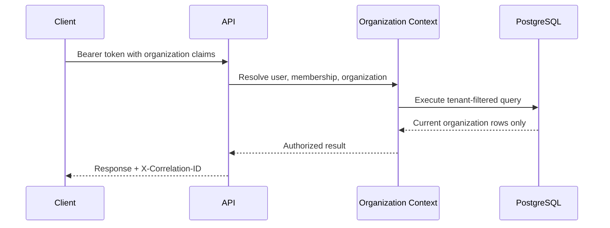

# Architecture and security

## System structure

The solution follows a layered architecture:



- `Treasury.Api` contains controllers, middleware, rate limits,
  health endpoints, background workers, authentication setup, and
  dependency registration.
- `Treasury.Application` contains DTOs, interfaces, validators,
  and application services.
- `Treasury.Domain` contains business entities.
- `Treasury.Infrastructure` contains repositories, persistence,
  email delivery, authentication support, and business service
  implementations.
- `Treasury.Shared` contains shared constants and common helpers.
- `Treasury.Tests` contains unit and PostgreSQL-backed integration
  tests.

## Tenant isolation

Every organization-owned entity carries an `OrganizationId`.
Entity Framework query filters compare that value with the
organization in the current authenticated context. New records
are stamped with the same organization.



An authenticated user can only switch to another organization
when an active membership exists there. Switching issues a new
organization-scoped access token and replaces the rotating
HttpOnly refresh-token cookie. A client must replace its
in-memory access token and discard all tenant-specific cached
data after a successful switch.

`PlatformAdmin` is deliberately separate. It uses the reserved
platform organization for organization-application review and
does not become an ordinary treasury user in customer
organizations.

## Authentication security

- Passwords are stored as hashes, never plaintext.
- JWT access tokens are short-lived.
- Refresh tokens are stored server-side as hashes, delivered
  only through Secure, HttpOnly cookies, and rotate during
  refresh.
- Browser clients keep access tokens in memory and never store
  refresh-token values.
- Reuse of a rotated refresh token is treated as a security
  event.
- Users can view and revoke their sessions, sign out everywhere,
  or sign out other sessions.
- Login, refresh, password recovery, MFA, and organization
  application endpoints are rate-limited.
- Repeated failed login attempts trigger a lockout window.
- TOTP MFA and one-time recovery codes are supported.
- Authentication security events are retained and searchable by
  authorized administrators.

## Maker-checker controls

Financial operations that require approval create pending
requests instead of immediately posting. The initiating user
cannot approve their own request. Approval policies determine
the threshold, required approval count, currency, and expiry.

Supported policy operations include:

- internal transfers;
- cash payments;
- transaction reversals;
- investment placement activation;
- investment early redemption;
- investment rollover;
- credit-facility activation.

Approvals, rejections, and expirations are immutable evidence.
The pending-request worker expires requests that remain
incomplete beyond their configured period.

## Financial integrity

- Account changes, treasury transaction headers, and ledger
  entries are saved atomically.
- Account concurrency tokens detect overlapping balance updates.
- Reserved balances prevent multiple pending payments from
  spending the same funds.
- Client idempotency keys protect supported cash operations from
  accidental retries.
- Completed transactions are not edited; corrections use the
  reversal workflow.
- Historical transaction records are reporting-only and never
  change live balances.
- Cutover opening balances post one completed transaction and one
  ledger entry per imported account in a single database
  transaction.

## API protection

- Role authorization is applied at controller and operation
  level.
- Production uses an explicit credentialed CORS allow-list; no
  wildcard origin is permitted.
- Cookie-based refresh requires `X-Treasury-Client: web`, which
  forces cross-origin browsers through CORS preflight.
- Forwarded headers are accepted only from configured proxy IPs.
- HSTS and restrictive response headers are enabled in
  production.
- Every response has an `X-Correlation-ID`; a safe client value
  is reused, otherwise the API generates one.
- Error responses use stable codes and do not expose stack traces.
- Health responses contain status and timing only, not exception
  or connection details.

## Standard error shape

```json
{
  "code": "conflict",
  "message": "The resource cannot be changed in its current state.",
  "traceId": "62f97412d6074fd9977c63bedf0cab08",
  "errors": null
}
```

Typical mappings:

| HTTP | Code | Meaning |
|---|---|---|
| 400 | `invalid_request` / `validation_error` | Invalid input |
| 401 | `authentication_failed` | Authentication failed |
| 403 | `operation_forbidden` | Authenticated but not permitted |
| 404 | `resource_not_found` | Resource does not exist in the current tenant |
| 409 | `conflict` / `concurrency_conflict` | State or concurrency conflict |
| 422 | `business_rule_violation` / `invalid_operation` | Business rule rejected the operation |
| 429 | `rate_limit_exceeded` | Too many requests |
| 500 | `internal_error` | Unexpected server error |

Use the returned `traceId` or `X-Correlation-ID` when reporting a
problem.
