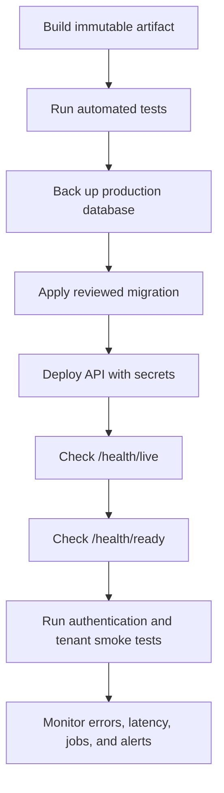

# Development and deployment

## Prerequisites

- .NET 10 SDK
- PostgreSQL
- Entity Framework Core CLI tools
- Docker for PostgreSQL Testcontainers integration tests

Confirm the SDK:

```powershell
dotnet --info
```

Install or update the EF CLI if required:

```powershell
dotnet tool install --global dotnet-ef
```

## Local configuration

The API project has a user-secrets identifier. Keep the
development database password and JWT secret out of committed
JSON.

```powershell
dotnet user-secrets set `
  "ConnectionStrings:DefaultConnection" `
  "Host=localhost;Port=5432;Database=treasury;Username=postgres;Password=CHANGE_ME" `
  --project Treasury.Api

dotnet user-secrets set `
  "JwtSettings:SecretKey" `
  "CHANGE_TO_A_RANDOM_SECRET_OF_AT_LEAST_32_CHARACTERS" `
  --project Treasury.Api
```

The default development issuer and audience are in
`Treasury.Api/appsettings.json`. Override them if the client
environment requires different values.

Email can remain disabled during development. Invitation and
password-reset delivery must then be tested through an approved
development-only manual-link configuration, a local/test SMTP server,
or the Resend HTTPS provider. Do not enable manual invitation URLs in
Production.

`Treasury.Api/appsettings.Development.json` is intentionally
ignored because it can contain local settings. Start from
`Treasury.Api/appsettings.Development.example.json` when creating
or refreshing that file.

## Database migrations

Create a migration after changing the EF model:

```powershell
dotnet ef migrations add MigrationName `
  --project Treasury.Infrastructure `
  --startup-project Treasury.Api
```

Apply all pending migrations:

```powershell
dotnet ef database update `
  --project Treasury.Infrastructure `
  --startup-project Treasury.Api
```

Check migration status:

```powershell
dotnet ef migrations list `
  --project Treasury.Infrastructure `
  --startup-project Treasury.Api
```

Generate an idempotent production migration script for review:

```powershell
dotnet ef migrations script --idempotent `
  --project Treasury.Infrastructure `
  --startup-project Treasury.Api `
  --output artifacts\treasury-migration.sql
```

Review and back up the target database before a production
schema change. Run migrations as a controlled deployment step;
do not give every application instance unrestricted schema-change
permissions.

## Build and run

```powershell
dotnet restore TreasuryManagementSystem.slnx
dotnet build TreasuryManagementSystem.slnx --no-restore
dotnet run --project Treasury.Api
```

Development URLs:

- HTTPS API: `https://localhost:7126`
- HTTP API: `http://localhost:5196`
- Swagger: `https://localhost:7126/swagger`
- Liveness: `https://localhost:7126/health/live`
- Readiness: `https://localhost:7126/health/ready`

The React development server will use port `5173`. Configure its
Vite `/api` proxy to forward to the HTTPS API. The Development
example disables `Secure` only for this local, same-origin proxy
workflow; Production startup rejects a non-Secure refresh-token
cookie. Never use the Development override in a deployed
environment.

Trust the ASP.NET Core development certificate if the browser or
frontend rejects the local HTTPS certificate:

```powershell
dotnet dev-certs https --trust
```

## PlatformAdmin bootstrap

The first `PlatformAdmin` is not created through an organization
invitation. Review the identity values at the top of
`scripts/Bootstrap-PlatformAdmin.ps1`, then run:

```powershell
.\scripts\Bootstrap-PlatformAdmin.ps1
```

The script:

1. builds the API;
2. prompts securely for a password and confirmation;
3. validates password complexity;
4. enables bootstrap settings for that child process only;
5. creates and verifies the reserved platform identity; and
6. clears plaintext password variables and temporary settings.

Run bootstrap only from a trusted administrative environment.
If the email already belongs to a non-platform user, the command
stops rather than elevating that identity. Use a different email
or resolve the identity deliberately; never edit the database to
force the role.

After bootstrap, use the recommended application-review flow to
create customer organizations and their first `Admin`.

## Tests

Run the complete suite:

```powershell
dotnet test TreasuryManagementSystem.slnx --no-build
```

Integration tests use PostgreSQL Testcontainers and therefore
require a running Docker engine.

To run tests that do not require Docker:

```powershell
dotnet test Treasury.Tests `
  --filter "FullyQualifiedName!~Integration"
```

Targeted integration examples:

```powershell
dotnet test Treasury.Tests `
  --filter "FullyQualifiedName~DeploymentReadinessIntegrationTests"

dotnet test Treasury.Tests `
  --filter "FullyQualifiedName~HistoricalTransactionImportIntegrationTests"
```

## Production configuration

Start with
`Treasury.Api/appsettings.Production.example.json`. The concise
configuration checklist is also available in
[Production configuration](../PRODUCTION_CONFIGURATION.md).

Supply secrets through the hosting platform's secret manager or
environment variables. Required values include:

| Setting | Purpose |
|---|---|
| `ConnectionStrings__DefaultConnection` | PostgreSQL connection |
| `JwtSettings__SecretKey` | JWT signing key, at least 32 secure characters |
| `JwtSettings__Issuer` | Expected token issuer |
| `JwtSettings__Audience` | Expected token audience |
| `AllowedHosts` | Explicit API host names, never `*` |
| `DeploymentReadiness__AllowedOrigins__0` | First HTTPS frontend origin |
| `DeploymentReadiness__DataProtectionKeysPath` | Persistent shared key storage |
| `RefreshTokenCookie__Secure` | Must remain `true` |
| `RefreshTokenCookie__SameSite` | `Strict` for same-site deployment; `None` only when cross-site hosting is required |
| `UserInvitations__AcceptanceUrl` | HTTPS frontend invitation route |
| `PasswordRecovery__ResetUrl` | HTTPS frontend password-reset route |

Production email delivery is required by default. Render Free uses the
Resend HTTPS provider because it blocks outbound SMTP ports:

| Setting | Requirement |
|---|---|
| `EmailDelivery__Enabled` | `true` |
| `EmailDelivery__Provider` | `Resend` on Render Free; `Smtp` where SMTP is allowed |
| `EmailDelivery__ResendApiKey` | Secret-managed Resend API key when `Provider=Resend` |
| `EmailDelivery__FromAddress` | Verified sender address |

The SMTP provider instead requires `Host`, `Port`, and any provider
credentials.

When behind a reverse proxy:

- set `DeploymentReadiness__UseForwardedHeaders=true`;
- list only trusted proxy IPs in
  `DeploymentReadiness__TrustedProxies`;
- set an appropriate forward limit; and
- terminate TLS only in a trusted, documented topology.

The API validates critical Production settings at startup and
fails closed when they are missing or unsafe.

## Deployment sequence



Recommended release gates:

1. build with zero errors;
2. automated suite passes;
3. migration script reviewed;
4. backup and rollback procedure verified;
5. secrets, allowed origins, hosts, proxy IPs, URLs, email, and
   data-protection storage verified;
6. liveness and readiness return healthy;
7. invitation, login, MFA, organization scoping, one financial
   transaction, and one report are smoke-tested;
8. correlation IDs are visible in centralized logs;
9. background-job ownership and monitoring are active.

## Production integrations still outside the API

The current backend does not itself provide:

- a web or mobile frontend;
- direct bank payment-rail initiation;
- live bank-statement feeds;
- live market FX-rate feeds;
- an external identity provider or enterprise SSO;
- infrastructure provisioning;
- a centralized log, metric, trace, or alert-delivery platform;
- backup storage, disaster recovery automation, or key-vault
  infrastructure.

These are deployment or future integration workstreams, not
hidden API endpoints.
