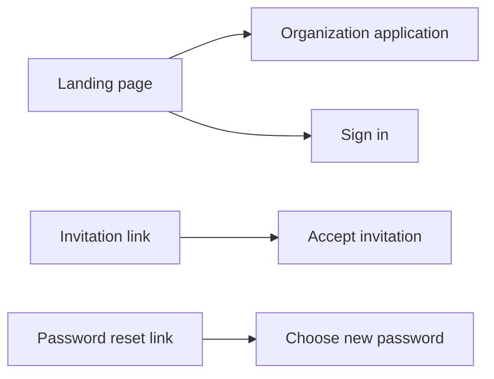
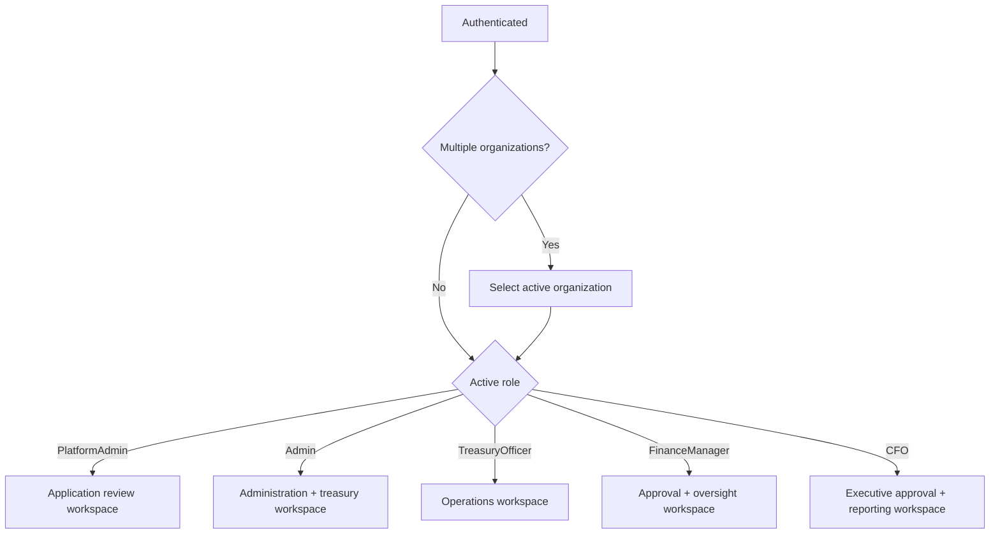
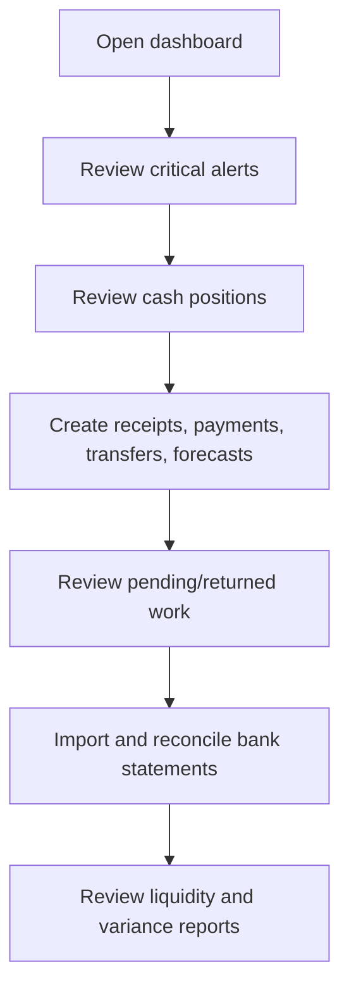

# Frontend application flow

This is the recommended screen and navigation flow for a web or
mobile client. Backend authorization remains authoritative.

## Public area

Public routes should include:

- `/apply`
- `/login`
- `/accept-invitation?token=...`
- `/forgot-password`
- `/reset-password?token=...`
- `/mfa/challenge`

Do not store invitation, reset, MFA challenge, access, or refresh
tokens in analytics events or browser logs.

## Authenticated shell

After authentication:

1. Load the current user and active organization claims.
2. Load available organizations.
3. If more than one membership exists, display an organization
   switcher.
4. Build navigation for the active role.
5. Load dashboard data for the active organization.
6. Show the correlation ID on error-detail or support screens.

## Recommended main navigation

### Common treasury navigation

- Dashboard
- Accounts and ledgers
- Transactions
- Transfers
- Cash receipts and payments
- Pending approvals
- Reconciliation
- Forecasts
- FX
- Investments
- Credit facilities
- Alerts
- Reports

### Admin navigation

- Organization profile
- Legal entities
- Business units
- Users and invitations
- Approval policies
- Historical imports and cutover
- Authentication security events
- Audit logs
- Deployment/support information

### PlatformAdmin navigation

- Submitted applications
- Applications under review
- Approved applications
- Rejected applications
- Admin invitation delivery/resend

## First-Admin setup checklist

Show this as a persistent checklist until complete:

1. Accept the invitation and sign in.
2. Enroll MFA and save recovery codes.
3. Verify the organization profile.
4. Verify or update the default legal entity.
5. Verify or update the default business unit.
6. Create treasury accounts.
7. Configure approval policies.
8. Import existing history or cutover balances when applicable.
9. Reconcile cutover balances.
10. Invite the CFO, Finance Managers, and Treasury Officers.
11. Review alert thresholds and reporting currency.

## Daily operator journey

## Approver journey

1. Open the pending-approval queue for the relevant module.
2. Open request detail and approval history.
3. Review maker, amount, currency, account, supporting reference,
   and current policy.
4. Approve or reject with a reason where required.
5. Confirm whether the request is fully approved or still needs
   additional approvals.
6. Verify the completed transaction or final rejected state.

The UI should never imply that one approval completes a request
when the policy requires more.

## Error handling

For any non-success response:

1. Read `code`, `message`, `errors`, and `traceId`.
2. Map validation errors to fields.
3. On `401`, attempt one safe refresh if a current refresh token
   exists; otherwise return to login.
4. On `403`, show an access message without retrying.
5. On `409`, refresh the record and explain that its state
   changed.
6. On `429`, honor `Retry-After`.
7. Preserve and display the correlation ID for support.

Never automatically retry a financial POST unless the operation
supports an idempotency key and the exact same key and payload are
reused.
