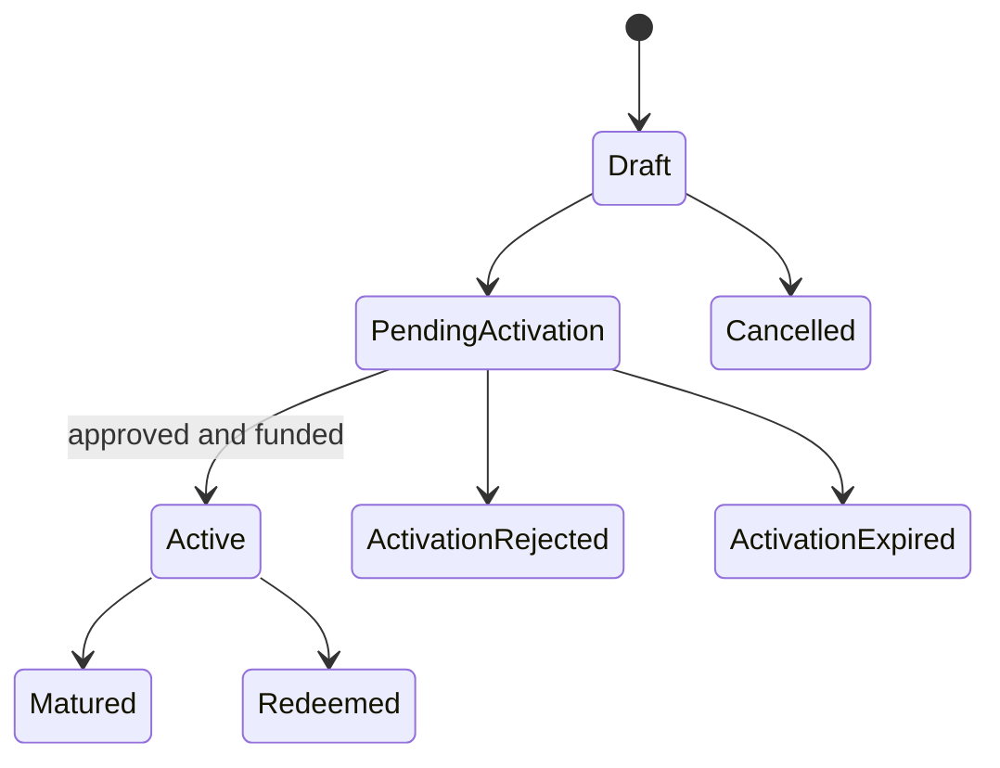
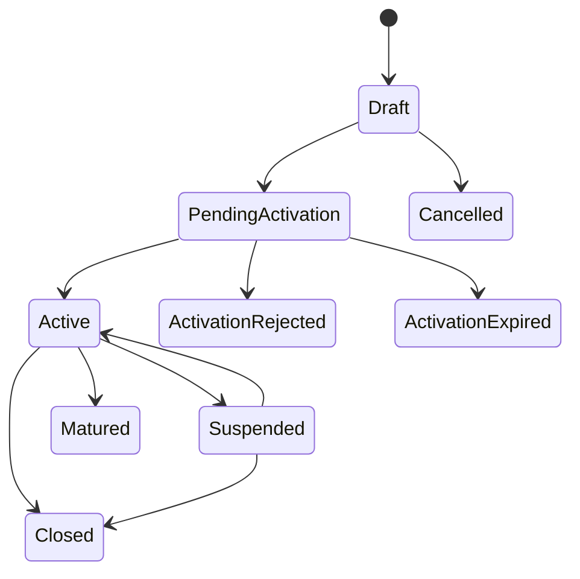

# Investments and credit facilities

## Shared master data

### Counterparties

- `POST /api/counterparties`
- `GET /api/counterparties`
- `GET /api/counterparties/{id}`
- `PUT /api/counterparties/{id}`
- `PATCH /api/counterparties/{id}/status`

Only active, eligible counterparties should be used for new
placements or facilities.

### Investment limits

- `POST /api/investment-limits`
- `GET /api/investment-limits`
- `GET /api/investment-limits/{id}`
- `PUT /api/investment-limits/{id}`
- `PATCH /api/investment-limits/{id}/status`
- `GET /api/investment-limits/utilization`
- `GET /api/investment-limits/utilization/export/csv`

Limit utilization supports exposure monitoring. Warning and
breach conditions can create treasury alerts.

## Investment placements

Core endpoints:

- `POST /api/investment-placements`
- `GET /api/investment-placements`
- `GET /api/investment-placements/{id}`
- `POST /api/investment-placements/{id}/activate`
- `POST /api/investment-placements/{id}/approve-activation`
- `POST /api/investment-placements/{id}/reject-activation`
- `PATCH /api/investment-placements/{id}/counterparty`
- `POST /api/investment-placements/{id}/redeem`
- `POST /api/investment-placements/{id}/cancel`
- `POST /api/investment-placements/process-maturities`

Activation can require maker-checker approval. Funding and the
resulting treasury transaction are applied when activation
completes, not merely when the draft is created.

Reports:

- `GET /api/investment-placements/portfolio-report`
- `GET /api/investment-placements/portfolio-report/export/csv`
- `GET /api/investment-placements/maturity-schedule`
- `GET /api/investment-accruals/report`
- `POST /api/investment-accrual-snapshots/generate`
- `GET /api/investment-accrual-snapshots`
- `GET /api/investment-accrual-snapshots/export/csv`

## Early redemption

1. Get a quote:
   `GET /api/investment-early-redemptions/{investmentPlacementId}/quote`.
2. Create a request:
   `POST /api/investment-early-redemptions/{investmentPlacementId}/requests`.
3. Review it in
   `GET /api/investment-early-redemptions/requests/pending`.
4. Approve or reject with the request-specific endpoint.
5. Execute an approved request.

Detail and decision endpoints:

- `GET /api/investment-early-redemptions/requests/{requestId}`
- `POST /api/investment-early-redemptions/requests/{requestId}/approve`
- `POST /api/investment-early-redemptions/requests/{requestId}/reject`
- `POST /api/investment-early-redemptions/requests/{requestId}/execute`

Approval and execution are separate controls. A quote can become
stale; always reload the request before execution.

## Investment rollover

Rollover follows the same quote, request, approval, and execution
pattern:

- `GET /api/investment-rollovers/{investmentPlacementId}/quote`
- `POST /api/investment-rollovers/{investmentPlacementId}/requests`
- `GET /api/investment-rollovers/requests/{requestId}`
- `GET /api/investment-rollovers/requests/pending`
- `POST /api/investment-rollovers/requests/{requestId}/approve`
- `POST /api/investment-rollovers/requests/{requestId}/reject`
- `POST /api/investment-rollovers/requests/{requestId}/execute`

## Credit facilities

Facility endpoints:

- `POST /api/credit-facilities`
- `GET /api/credit-facilities`
- `GET /api/credit-facilities/{id}`
- `PUT /api/credit-facilities/{id}`
- `POST /api/credit-facilities/{id}/activate`
- `POST /api/credit-facilities/{id}/approve-activation`
- `POST /api/credit-facilities/{id}/reject-activation`
- `POST /api/credit-facilities/{id}/cancel`
- `POST /api/credit-facilities/{id}/suspend`
- `POST /api/credit-facilities/{id}/reactivate`
- `POST /api/credit-facilities/{id}/close`
- `POST /api/credit-facilities/process-maturities`

### Drawdowns

- `POST /api/credit-facilities/{creditFacilityId}/drawdowns`
- `GET /api/credit-facilities/{creditFacilityId}/drawdowns`
- `GET /api/credit-facilities/{creditFacilityId}/drawdowns/{drawdownId}`

A completed drawdown increases the designated cash account and
records a treasury transaction.

### Repayments

- `POST /api/credit-facilities/{creditFacilityId}/repayments`
- `GET /api/credit-facilities/{creditFacilityId}/repayments`
- `GET /api/credit-facilities/{creditFacilityId}/repayments/{repaymentId}`

A completed repayment reduces the cash account and the facility
outstanding position according to the business rules.

### Interest accrual

- `POST /api/credit-facility-interest-accruals/generate`
- `GET /api/credit-facility-interest-accruals`

Production scheduling should call accrual and maturity processing
under controlled operational ownership. Monitor failures and
prevent overlapping runs.

## Control points

- Review counterparty status and limits before placement.
- Confirm source or destination account, currency, value date,
  rate, term, and maturity date.
- Separate creation from approval where policy requires it.
- Recheck limit utilization immediately before funding.
- Monitor upcoming maturities and overdue facility obligations.
- Reconcile every funding, redemption, drawdown, and repayment
  with the bank statement.

