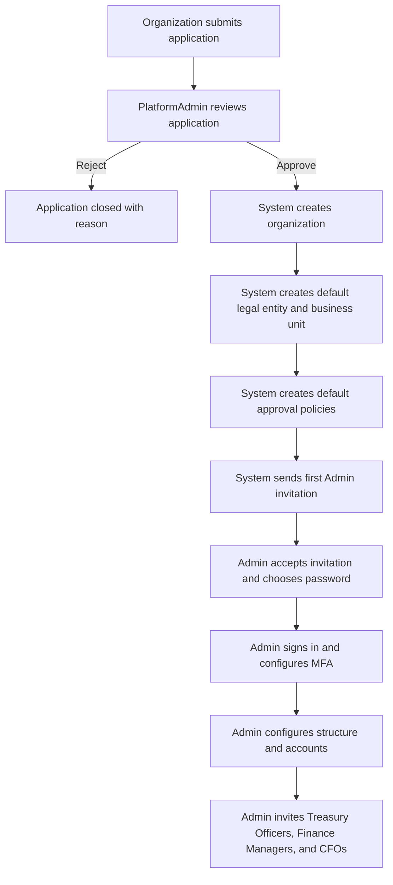
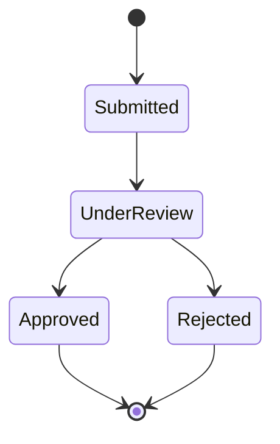
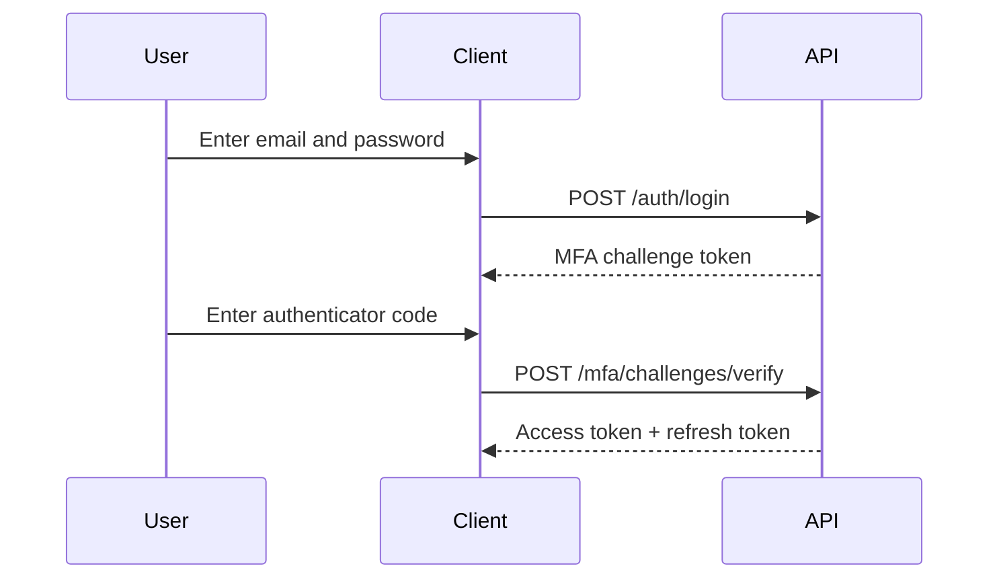

# Organization onboarding and authentication

## Recommended production onboarding

The platform uses managed onboarding. An applicant does not
directly create an organization or grant themselves the `Admin`
role.



MFA is implemented and strongly recommended for the first Admin
and all approvers. The current backend does not automatically
force enrollment immediately after invitation acceptance, so the
frontend onboarding checklist should require and visibly track
this step.

## 1. Organization application

Public endpoint:

`POST /api/v1/organization-applications`

Send a new non-empty GUID in the `Idempotency-Key` request
header. If the client must retry because the outcome is unknown,
reuse the same key and exact payload.

Example:

```json
{
  "organizationName": "Example Manufacturing Limited",
  "registrationNumber": "RC123456",
  "taxIdentificationNumber": "12345678-0001",
  "countryCode": "NG",
  "baseCurrency": "NGN",
  "adminFirstName": "Ada",
  "adminLastName": "Okafor",
  "adminEmail": "ada@example.com",
  "contactPhoneNumber": "+2348000000000",
  "applicationNotes": "Treasury team onboarding"
}
```

The request is rate-limited. Duplicate application and identity
rules are checked without exposing whether unrelated user data
exists.

## 2. Platform review

The authenticated `PlatformAdmin` uses:

- `GET /api/platform/organization-applications`
- `GET /api/platform/organization-applications/{applicationId}`
- `POST /api/platform/organization-applications/{applicationId}/review`
- `POST /api/platform/organization-applications/{applicationId}/approve`
- `POST /api/platform/organization-applications/{applicationId}/reject`

Application states:



Approval requires a concurrency token and supplies the new
organization code and slug, default legal entity, default
business unit, and initial approval-policy values. Provisioning
and invitation creation occur atomically.

## 3. First Admin invitation

Production sends the acceptance link by SMTP. If delivery fails,
the application remains approved and the `PlatformAdmin` can use:

`POST /api/platform/organization-applications/{applicationId}/admin-invitation/resend`

Development can explicitly return a manual invitation URL while
SMTP is disabled. Production validation prevents that behavior.

The invited person calls:

`POST /api/v1/auth/invitations/accept`

```json
{
  "token": "token-from-invitation-link",
  "password": "A-strong-new-password"
}
```

For a new identity, the password is required. If an existing user
accepts an invitation to another organization, the existing
password remains unchanged.

## 4. Login and MFA

Initial login:

`POST /api/v1/auth/login`

```json
{
  "email": "ada@example.com",
  "password": "A-strong-new-password"
}
```

When MFA is not enabled, the response contains access and refresh
tokens. When MFA is enabled, `mfaRequired` is `true` and the
response contains an expiring challenge token instead of an
authenticated session.

MFA login:



Enrollment endpoints:

- `POST /api/v1/auth/mfa/enrollment/start`
- `POST /api/v1/auth/mfa/enrollment/confirm`
- `POST /api/v1/auth/mfa/recovery-codes/regenerate`
- `POST /api/v1/auth/mfa/disable`

Show recovery codes once and instruct the user to store them
offline. A recovery code is consumed through
`POST /api/v1/auth/mfa/challenges/recovery-code`.

## 5. Sessions and refresh

- `POST /api/v1/auth/refresh` rotates the refresh token.
- `GET /api/v1/auth/sessions` lists active sessions.
- `DELETE /api/v1/auth/sessions/{sessionId}` revokes one owned
  session.
- `POST /api/v1/auth/logout` revokes the current session.
- `POST /api/v1/auth/logout-others` revokes other sessions.
- `POST /api/v1/auth/logout-all` revokes all sessions.

The client must replace the stored refresh token after every
successful refresh. Reusing an older token can revoke the token
family as a security response.

## 6. Multiple organizations

- `GET /api/v1/auth/organizations` lists active memberships.
- `POST /api/v1/auth/organizations/switch` selects another
  membership and returns a new token pair.

After switching, clear tenant-specific client state. Never reuse
accounts, dashboards, IDs, or cached responses from the previous
organization.

## 7. Organization user administration

Only an organization `Admin` can:

- list users and roles;
- invite a user;
- list, resend, or revoke invitations;
- change a user's organization role;
- activate or deactivate a user membership.

Endpoints are under `/api/admin`. The `PlatformAdmin` role is
excluded from assignable organization roles.

## Password recovery

- `POST /api/v1/auth/password/forgot`
- `POST /api/v1/auth/password/reset`

Forgot-password responses do not reveal whether the email exists.
Production SMTP is required so genuine users can receive the
reset link.
