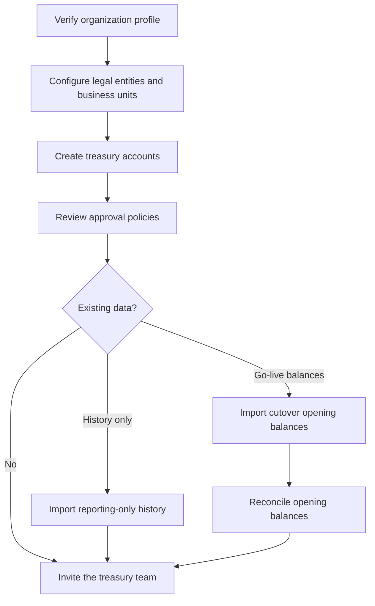
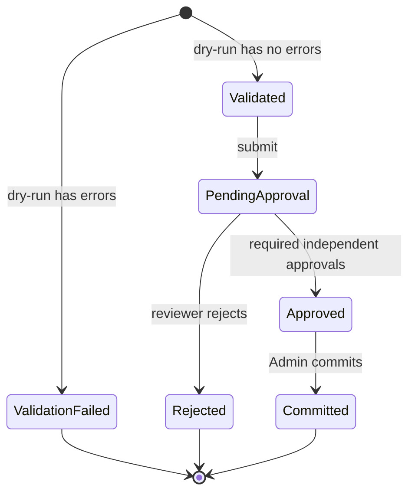

# Organization setup and cutover

This guide covers the work performed by the first organization
`Admin` after accepting the onboarding invitation.

## Setup sequence

## Organization structure

Approval creates one default legal entity and one default
business unit. The organization `Admin` should verify these
before creating accounts.

Organization endpoints:

- `GET /api/v1/organization`
- `PUT /api/v1/organization`
- `GET /api/v1/organization/legal-entities`
- `POST /api/v1/organization/legal-entities`
- `PUT /api/v1/organization/legal-entities/{id}`
- `PATCH /api/v1/organization/legal-entities/{id}/status`
- `GET /api/v1/organization/business-units`
- `POST /api/v1/organization/business-units`
- `PUT /api/v1/organization/business-units/{id}`
- `PATCH /api/v1/organization/business-units/{id}/status`

The active legal entity is not generated for every transaction.
It is a persistent organization record created during
provisioning or explicitly by an `Admin`. Transactions and
accounts reference an existing legal entity and, where
applicable, an existing business unit.

## Accounts and opening balances

Use `POST /api/accounts` to create an account. The account can be
created with an opening balance. A non-zero opening balance
atomically creates:

- the account;
- a completed `OpeningBalance` treasury transaction;
- a debit ledger entry; and
- the resulting account balance.

There are two valid ways to establish an opening balance:

1. Set `openingBalance` during direct account creation.
2. Create the account with a zero balance, then use a
   `CutoverOpeningBalances` import.

Do not use both methods for the same account. Cutover rejects an
account that already has a balance, reservation, or financial
activity.

Useful endpoints:

- `POST /api/accounts`
- `GET /api/accounts`
- `GET /api/accounts/{id}/ledger`
- `GET /api/transactions`
- `GET /api/transactions/{reference}`

## Historical-import modes

| Mode | Purpose | Changes live account balance? | Commit result |
|---|---|---:|---|
| `HistoricalTransactions` | Preserve transactions that happened before the platform was adopted | No | Searchable reporting records |
| `CutoverOpeningBalances` | Establish verified balances at the platform go-live date | Yes | Posted opening-balance transactions and ledger entries |

Historical transactions are intentionally separate from the
live treasury ledger. They support reporting and audit without
replaying old cash movements into current balances.

## Import lifecycle

A validation-failed batch is evidence of that upload attempt.
Correct the source file and start a new dry-run rather than
editing validated rows in place.

## Import procedure

### 1. Download the template

`GET /api/v1/historical-imports/template?mode={mode}`

Use the returned CSV template and preserve its column names. The
mode must be either `HistoricalTransactions` or
`CutoverOpeningBalances`.

### 2. Run validation

`POST /api/v1/historical-imports/dry-run`

Send a new GUID in the `Idempotency-Key` header. The body carries
the mode and CSV file as `multipart/form-data`; the server uses
the header value as the import key. If a network retry is
necessary, reuse the exact key, mode, and file.

Inspect:

- `GET /api/v1/historical-imports/{batchId}`
- `GET /api/v1/historical-imports/{batchId}/rows`
- `GET /api/v1/historical-imports/{batchId}/errors`
- `GET /api/v1/historical-imports/{batchId}/errors/export/csv`

### 3. Submit for independent review

`POST /api/v1/historical-imports/{batchId}/submit`

Pass the current `concurrencyToken`. The uploader cannot review
their own batch.

### 4. Review and decide

- `POST /api/v1/historical-imports/{batchId}/approve`
- `POST /api/v1/historical-imports/{batchId}/reject`
- `GET /api/v1/historical-imports/{batchId}/decisions`
- `GET /api/v1/historical-imports/{batchId}/approval-report`
- `GET /api/v1/historical-imports/{batchId}/approval-report/export/csv`

Approval requirements:

- `HistoricalTransactions`: one independent `Admin`,
  `FinanceManager`, or `CFO`.
- `CutoverOpeningBalances`: two independent approvals, one made
  while acting as `Admin` and one made while acting as `CFO`.

Each state-changing request must use the latest concurrency token
returned by the preceding response.

### 5. Commit

Only an organization `Admin` can call:

`POST /api/v1/historical-imports/{batchId}/commit`

Commit is atomic. A cutover batch either posts every valid
opening balance or none of them.

### 6. Verify

For historical reporting records:

- `GET /api/v1/historical-imports/records`
- `GET /api/v1/historical-imports/records/{recordId}`
- `GET /api/v1/historical-imports/records/export/csv`

For cutover reconciliation:

- `GET /api/v1/historical-imports/{batchId}/opening-balance-reconciliation`
- `GET /api/v1/historical-imports/{batchId}/opening-balance-reconciliation/export/csv`

Also compare the account list, account ledger, treasury
transaction, and reporting balances before enabling normal
operations.

## Cutover control checklist

- Freeze legacy-system activity at the agreed cutover time.
- Record the cutover time and source-system report references.
- Ensure each target account exists with a zero balance.
- Ensure account currency and imported currency agree.
- Validate legal-entity, business-unit, and account mappings.
- Resolve every invalid row before submission.
- Obtain the independent `Admin` and `CFO` approvals.
- Export and retain the approval report.
- Commit once and retain the commit response.
- Export the opening-balance reconciliation report.
- Confirm no unresolved variance before normal treasury posting.
