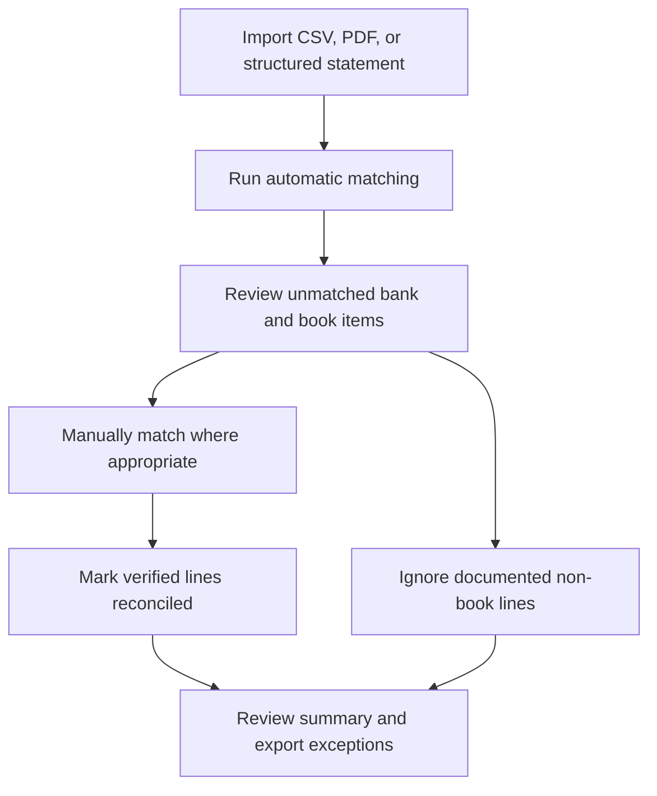

# Reconciliation, forecasting, and FX

## Bank-statement reconciliation

The reconciliation workflow imports a statement, matches bank
lines to book transactions, resolves exceptions, and records
final reconciliation status.

Import endpoints:

- `POST /api/bank-statements/imports/csv`
- `POST /api/bank-statements/imports/pdf`
- `POST /api/bank-statements/imports`
- `GET /api/bank-statements/imports/{id}`
- `GET /api/bank-statements/imports/{id}/summary`

Matching and exception endpoints:

- `POST /api/bank-statements/imports/{id}/auto-match`
- `POST /api/bank-statements/lines/{id}/manual-match`
- `POST /api/bank-statements/lines/{id}/reconcile`
- `POST /api/bank-statements/lines/{id}/unmatch`
- `POST /api/bank-statements/lines/{id}/ignore`
- `GET /api/bank-statements/unmatched`
- `GET /api/bank-statements/imports/{id}/exceptions`
- `GET /api/bank-statements/imports/{id}/book-exceptions`
- `GET /api/bank-statements/imports/{id}/exceptions/export/csv`
- `GET /api/bank-statements/imports/{id}/book-exceptions/export/csv`

Typical line states are `Unmatched`, `Matched`, `Reconciled`, and
`Ignored`. Ignoring a line is an explicit operational decision,
not a match.

### Statement controls

- Confirm the statement account and currency before importing.
- Prevent duplicate statement periods or files operationally.
- Compare opening balance, closing balance, and line totals.
- Review both bank-side and book-side exceptions.
- Document why a line is ignored.
- Export unresolved exceptions at the end of each close cycle.

PDF extraction depends on the quality and structure of the
source document. Review extracted lines before matching.

## Cash-flow forecasting

Forecasts capture expected cash flows and compare them with
realized activity.

- `POST /api/cash-flow-forecasts`
- `GET /api/cash-flow-forecasts/{id}`
- `GET /api/cash-flow-forecasts/active`
- `POST /api/cash-flow-forecasts/{id}/cancel`
- `POST /api/cash-flow-forecasts/{id}/realize`
- `GET /api/cash-flow-forecasts/report`
- `GET /api/cash-flow-forecasts/variance`
- `GET /api/cash-flow-forecasts/variance/export/csv`

Recommended flow:

1. Record expected inflows and outflows with value dates.
2. Review active forecasts by currency and date bucket.
3. Realize a forecast when the corresponding actual event is
   known.
4. Cancel expectations that will no longer occur.
5. Review and export variance regularly.

## FX rates and exposure

Rates are maintained by `Admin`, `FinanceManager`, or `CFO`.

- `POST /api/fx-rates`
- `PUT /api/fx-rates/{id}`
- `GET /api/fx-rates/{id}`
- `GET /api/fx-rates`
- `GET /api/fx-rates/latest`
- `GET /api/fx-rates/convert`
- `GET /api/fx-rates/cash-position`
- `GET /api/fx-rates/currency-exposure`

The latest-rate and conversion endpoints use recorded rate data;
they are not a live market-data feed. Production operations
should define a rate source, ownership, update frequency,
effective-time rule, and independent review process.

For exposure reporting:

- verify that every material currency pair has a current rate;
- show both native and reporting-currency amounts;
- identify stale or missing rates;
- avoid silently treating missing rates as 1:1; and
- retain the effective rate and time used in exported reports.

