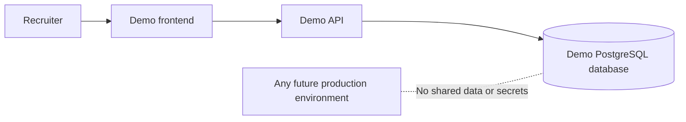

# Recruiter demo setup

Live frontend:
[Corporate Treasury Platform](https://corporatetreasuryplatform-frontend.mobolajiadebola.workers.dev/)

The owner has confirmed that the deployed database contains fictional data.
The account-isolation and privilege guidance below still applies.

## Recommendation

Do not publish credentials for an existing `PlatformAdmin`, `Admin`,
`FinanceManager`, or `CFO`. The current roles are operational roles, and even
`TreasuryOfficer` can submit or upload data.

The safe immediate approach is a separate demonstration deployment with its
own database and entirely fictional data. Never connect public demo credentials
to a database containing real people, organizations, bank details, or financial
records.

## Recommended topology



Use separate demo database, JWT signing key, email configuration,
data-protection keys, and URLs. A demo deployment must not share secrets or
storage with production.

## Create the isolated demo organization

Use the normal product workflow:

1. Submit an application using fictional information and a new GUID
   `Idempotency-Key`.
2. Log in privately as `PlatformAdmin`.
3. Begin review and approve the application.
4. Accept the first-Admin invitation through the demo frontend.
5. Configure fictional entities, accounts, policies, and sample data.
6. Invite a separate recruiter-facing user as `TreasuryOfficer`.
7. Verify that user has no membership in any other organization.

Suggested fictional identity:

```text
Organization: Northstar Demo Holdings
Organization code: NORTHSTAR-DEMO
Organization slug: northstar-demo-holdings
Legal entity: Northstar Demo Holdings Limited
Business unit: Head Office
Recruiter-facing role: TreasuryOfficer
```

Use an email address or alias you control. Do not use a recruiter's address as
a shared account, and do not publish access to the mailbox receiving password
resets.

## Temporary manual invitation delivery

If Resend is still using its owner-only testing sender, configure these Render
environment variables for the fictional demo organization:

```text
UserInvitations__ManualDemoDeliveryEnabled=true
UserInvitations__ManualDemoOrganizationCode=NORTHSTAR-DEMO
UserInvitations__AcceptanceUrl=https://corporatetreasuryplatform-frontend.mobolajiadebola.workers.dev/accept-invitation
```

Redeploy the API after saving the variables. Keep the existing email settings
enabled; this option bypasses email only for a `TreasuryOfficer` invitation in
the configured demo organization.

If the earlier Resend failure left a pending invitation:

1. Sign in as the fictional organization's Admin.
2. Call `GET /api/admin/invitations` and copy the pending invitation `id`.
3. Call `POST /api/admin/invitations/{invitationId}/resend`.
4. Copy `manualAcceptanceUrl` from that response immediately.

For a new invitation, call `POST /api/admin/invitations` with the
`TreasuryOfficer` role ID. The successful `201 Created` response contains the
same one-time `manualAcceptanceUrl` field.

Open that URL in a private browser window, choose the disposable demo password,
and complete invitation acceptance. Never put the URL in source control or
documentation: possession of an unexpired link authorizes account creation.
After the account works, set
`UserInvitations__ManualDemoDeliveryEnabled=false` and redeploy.

## Populate only fictional data

Create enough coherent data to demonstrate the product story:

- NGN, USD, and GBP accounts with clearly fictional account numbers;
- opening balances created once through the controlled cutover flow;
- completed and pending receipts, payments, and transfers;
- matched and unmatched bank-statement examples;
- expected and realized forecasts;
- sample FX rates and currency exposure;
- one investment placement and one credit facility;
- alerts, approval history, and dashboard data.

Label the organization and all exports as demonstration data.

## Reduce risk before sharing credentials

- Use a dedicated demo deployment and database.
- Use a non-admin `TreasuryOfficer` account.
- Keep every name, account number, counterparty, and balance fictional.
- Keep strict login and API rate limits enabled.
- Never disclose PlatformAdmin or organization-Admin credentials.
- Never expose Render, Neon, Cloudflare, Resend, GitHub, or database access.
- Keep SMTP and password-recovery mailbox access private.
- Restrict CORS to the demo frontend origin.
- Take a clean Neon branch or database backup before publishing the login.
- Reset the demo data regularly and after abusive use.
- Monitor audit and authentication-security events.

The account is isolated but is not technically read-only. A recruiter can still
create records allowed to a `TreasuryOfficer`. State this on the demo screen and
restore the dataset when necessary.

## Presenting credentials

Do not commit a live password to this repository, README, frontend source,
screenshots, or analytics. Display disposable credentials only on the deployed
demo login page or provide them privately.

Example demo notice:

```text
Demo workspace

This environment contains fictional data only and resets periodically.
Some changes may be cleared during the next reset.

Email: demo@example.com
Password: supplied on the demo login page
```

If a password is delivered to the browser, visitors can discover it. Treat it
as disposable and never reuse it anywhere else.

## Stronger long-term option

Before allowing broad public access, implement API-enforced read-only demo
mode. The server should identify the demo membership or organization and reject
state-changing requests except login, token refresh, and current-session
logout. Hiding frontend buttons is not a security control.

Add a protected reset job that restores a known fictional snapshot. Its key
must remain outside the frontend and should be invoked by a deployment job, not
a public browser endpoint.

## Verification checklist

Before sharing the URL, test in a private browser window:

1. The frontend and API wake successfully.
2. Demo login and refresh-cookie restoration work.
3. The account opens only `NORTHSTAR-DEMO`.
4. Admin, user-management, security-event, and platform routes return `403`.
5. No real personal or financial information appears in pages or exports.
6. Logout clears the session.
7. Rate limiting responds correctly.
8. Both health endpoints report healthy.
9. The reset procedure restores the expected dataset.

## Information required before publication

- Recruiter-safe demo email.
- Where the disposable password will be displayed.
- Demo reset schedule.
