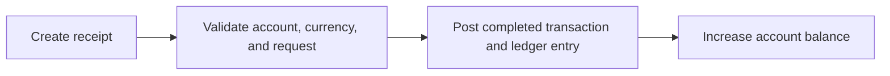
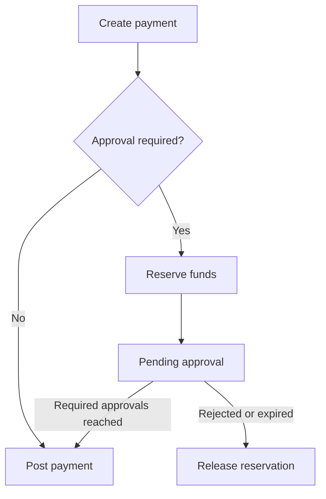
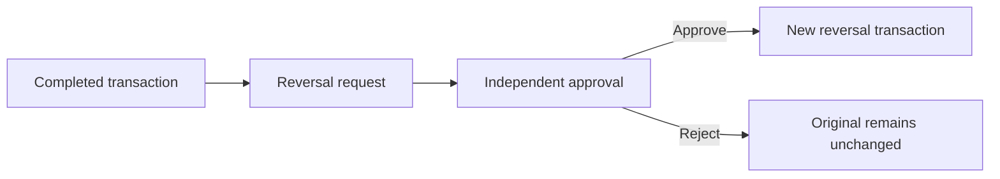

# Treasury operations

## Accounts and ledger

Accounts belong to the active organization and are associated
with an existing legal entity and, when supplied, business unit.

- `POST /api/accounts` creates an account.
- `GET /api/accounts` lists organization accounts.
- `GET /api/accounts/{id}/ledger` returns posted ledger activity.

Creating an account with a non-zero opening balance posts a
completed `OpeningBalance` transaction. For a bulk go-live
migration, create zero-balance accounts and use the controlled
cutover process described in
[Organization setup and cutover](organization-setup-and-cutover.md).

## Cash receipts

`POST /api/cash-movements/receipts`

A valid receipt posts immediately and increases the destination
account balance. Use the request idempotency key supplied by the
cash-movement contract when retrying the same business request.

## Cash payments

`POST /api/cash-movements/payments`

A payment can post immediately or enter approval, depending on
the active policy and amount. Pending payments reserve funds so
the same available balance cannot support multiple requests.

Approval endpoints:

- `GET /api/cash-movements/payments/pending`
- `POST /api/cash-movements/payments/{id}/approve`
- `POST /api/cash-movements/payments/{id}/reject`
- `GET /api/approval-history/payments/{requestId}`

The maker cannot approve their own payment. The response remains
pending until the policy's required approval count is reached.

## Internal transfers

`POST /api/transfers`

An internal transfer moves value between eligible accounts in
the same organization. Both sides are recorded atomically. It
may post immediately or use maker-checker approval.

- `GET /api/transfers/pending`
- `POST /api/transfers/{id}/approve`
- `POST /api/transfers/{id}/reject`
- `GET /api/approval-history/transfers/{requestId}`

Validate that source and destination are different and that
currency and available-balance rules are satisfied.

## Approval policies

Organization `Admin` endpoints:

- `GET /api/admin/approval-policies`
- `PUT /api/admin/approval-policies`

A policy is scoped by operation type and includes:

- threshold amount;
- currency;
- required approval count;
- pending-request expiry hours; and
- active status.

Review policies before go-live. A request retains the approval
requirements determined when it is created; do not assume a
later policy edit rewrites already-pending work.

## Reversals

Completed transactions are not edited or deleted. A correction
uses a reversal:

- `POST /api/transactions/{reference}/reversal-request`
- `GET /api/reversals/pending`
- `POST /api/reversals/{id}/approve`
- `POST /api/reversals/{id}/reject`
- `GET /api/approval-history/reversals/{requestId}`

The approved reversal creates a new linked financial transaction
and compensating ledger effect. It does not modify the original
audit evidence.

## Transaction inquiry

- `GET /api/transactions` supports organization transaction
  search.
- `GET /api/transactions/{reference}` returns one transaction.
- `GET /api/transactions/activity-summary` aggregates activity.
- `GET /api/transactions/export/csv` exports the filtered view.

Transaction types include internal transfer, opening balance,
cash receipt, cash payment, reversal, investment placement,
investment redemption, credit-facility drawdown, and
credit-facility repayment.

## Operational rules

- Always display available balance separately from reserved
  balance.
- Refresh the pending queue after every approval decision.
- Treat `409` as a signal to reload current state.
- Never retry a financial request with a new idempotency key if
  the outcome of the first request is unknown.
- Use reversal, not database edits, to correct a completed
  transaction.

